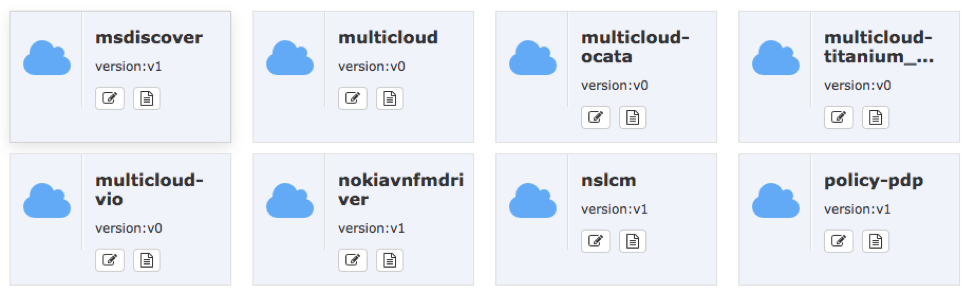

..
 This work is licensed under a Creative Commons Attribution 4.0
 International License.

===================================
ONAP MultiCloud Administrator Guide
===================================

The guide for MultiCloud Administrator.

Configuration
=============

Multicloud doesn’t have any configuration file for now.

Administration
==============

From MSB
--------

After Multicloud is up and running, administrator can check Multicloud
services from MSB. Go to MSB UI page, administrator should see several icons
with name that starts with multicloud.

The icon named Multicloud is the main framework of Multicloud services. And
other icons are the plugin for corresponding backend cloud. For example,
multilcloud-vio is the plugin for VMware Integrated OpenStack.

Administrator can manage Multicloud from MSB UI page. By clicking the icon
named multicloud, there will be available api URL in the bottom of MSB UI
page. After filling required fields, and clicking `Try it out!`, administrator
can perform GET/POST/PUT/DELETE over Multicloud.

From CLI
--------

Besides the MSB UI page, Administrator could manage Multicloud from command
line interface(CLI). Multicloud’s CLI is the same as OpenStack’s CLI, and
therefore, administrator can use OpenStack Client to manage Multicloud.
To make OpenStack Client work with Multicloud, administrator needs to set the
environment variables of operation system. An example of environment variables
is list as below:

::

    OS_AUTH_URL=http://<msb-ip>:80/api/multicloud/v0/<vim_info>/identity/v3
    OS_PROJECT_ID=<project id in backend OpenStack>
    OS_PROJECT_NAME=<project name in backend OpenStack>
    OS_USER_DOMAIN_NAME=<domain name in backend OpenStack>
    OS_USERNAME=<administrator username in backend OpenStack>
    OS_PASSWORD=<password of administrator in backend OpenStack>
    OS_REGION_NAME=<region name in backend OpenStack>
    OS_INTERFACE=internal
    OS_IDENTITY_API_VERSION=3

<msb-ip> in OS_AUTH_URL is the IP address of MSB. <vim-info> is composed of
cloud_type and cloud_region_id. These two attributes are information of cloud
from A&AI. Other environment variables listed above are some information from
Multicloud’s backend OpenStack.
After exporting above variables into operation system, administrator can use
OpenStack Client to manage Multicloud. For example:

::

    nova list

will list the virtual machine in Multicloud’s backend OpenStack.

Logging And Diagnostics
=======================

Logging file
------------

The logging file named "runtime_multivimbroker.log" located at /opt/multivimbroker/logs/ directory
would record  INFO, WARN, ERROR and DEBUG level of information.
The format string of logging is "%(asctime)s-%(funcName)s-%(filename)s-%(lineno)d-%(levelno)s-%(content string)s".
If there are any issues happened in framework service, you are able to check ERROR level logging to
diagnose the problem.
The content of this file list as below:

::

    2017-11-03 07:03:31,646:[multivimbroker.pub.utils.restcall]:[restcall.py]-[63][DEBUG]:request=http://192.168.10.45:80/api/multicloud/v0/vmware_vio/identity/v2.0)
    2017-11-03 07:08:38,020:[multivimbroker.pub.utils.restcall]:[restcall.py]-[63][DEBUG]:request=https://192.168.10.26:8443/aai/v11/cloud-infrastructure/cloud-regions/cloud-region/vmware/vio)
    2017-11-03 07:08:38,103:[multivimbroker.pub.utils.restcall]:[restcall.py]-[63][DEBUG]:request=http://192.168.10.45:80/api/multicloud/v0/vmware_vio/identity/v2.0)

The stdout of framework service named "nohup.out" located at /opt/multivimbroker/ record each http request.
The content of this file looks like as below:

::

    [25/Oct/2017 00:09:27] "POST /api/multicloud/v0/vmware_vio/identity/v2.0/tokens HTTP/1.0" 500 273
    [25/Oct/2017 14:17:27] "POST /api/multicloud/v0/vmware_fake/identity/v2.0/tokens HTTP/1.0" 200 5389
    [26/Oct/2017 23:44:13] "POST /api/multicloud/v0/vmware_vio/identity/v3/auth/tokens HTTP/1.0" 200 6213

Each line compose with http method, url and response code, so you are able to check the response status of
every http request.
