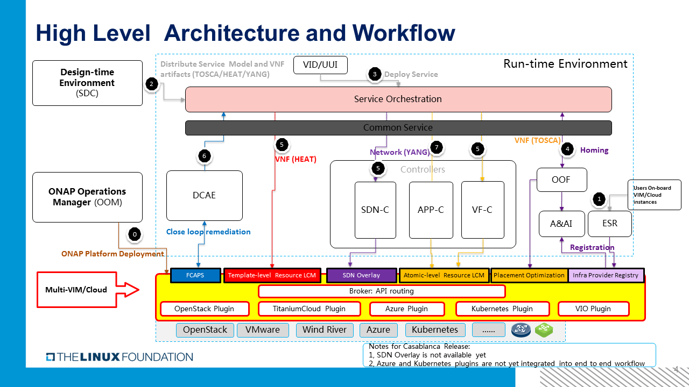

..
 This work is licensed under a Creative Commons Attribution 4.0
 International License.
 Copyright (c) 2018 Wind River Systems, Inc.

============================
ONAP MultiCloud Architecture
============================

Value Proposition
-----------------

ONAP MultiCloud project aims to mediate most interactions (if not all of them)
between ONAP and any underlying VIM or Cloud to:

* enable ONAP to deploy and run on multiple infrastructure environments
* provide a Cloud Mediation Layer, supporting multiple infrastructures and
  network backends to effectively prevent vendor lock-in
* decouples the evolution of ONAP platform from the evolution of underlying
  cloud infrastructure, and minimizes the impact on the deployed ONAP while
  upgrading the underlying cloud infrastructure independently

Besides that, ONAP MultiCloud project enables

* infrastructure providers exposing infrastructure's resources and features
  to ONAP for optimization of homing and placement of VNFs
* support the closed control loop remediation over infrastructure resources

High Level Architecture and Workflows
-------------------------------------

The following high level architecture and workflow diagram depicts how
ONAP MultiCloud is designed and integrated into ONAP end to end workflow

Components:
~~~~~~~~~~~
**Broker:**

A single broker deployed as micro-service exposes following functionalities:

* Expose metadata list of supported plugins to ESR
* Route and forward API requests to appropriate plugin by looking up AAI cloud
  region with ID of the cloud region
* Dispatch capacity checking API to all related plugins

**Plugin(s):**

Plugin adapts API requests to corresponding VIM/Cloud.

There are multiple plugins deployed as micro-services available:

* Plugin for Wind River: Adapt to Wind River Titanium Cloud R3, R4 or R5
* Plugin for Ocata/Pike: Adapt to Vanilla OpenStack Releases: Ocata, Pike
* Plugin for VIO: Adapt to VMware VIO
* Plugin for Azure: Adapt to Microsoft Azure Cloud.
* Plugin for kubernetes: Adapt to Kubernetes clusters

Dependencies:
~~~~~~~~~~~~~

* MultiCloud micro-services exposed services via MSB
* MultiCloud relies on MSB for API forwarding between broker and plugin
  micro-services
* MultiCloud micro-services relies on AAI for any persistent data storage.
  e.g. AAI Cloud Region Object

Workflow elaboration:
~~~~~~~~~~~~~~~~~~~~~

0) OOM Deploys ONAP MultiCloud services
#) ONAP users on-boards underlying VIM or Cloud instances via ONAP ESR GUI.
    ESR creates AAI cloud region object and requests MultiCloud to update the
    cloud region with discovered infrastructure's resources and capabilities

#) SDC distributes Service Model and VNF artifacts

#) ONAP users deploy services, instantiate VNF

#) ONAP SO consult OOF for VNF homing and placement hints, OOF matches the
    VNF's requirement and cloud region's capabilities and resources to select
    the best candidates for VNF homing.OOF also consult MultiCloud for checking
    the capacity for VNF placement.

#) The VNF instantiating
    The VNF instantiating approach varies with different use case (or VNF
    artifacts type):

      In case of VIM/Cloud specific artifact type, e.g. HEAT templates, SO
      invokes MultiCloud directly to instantiate the VNF.

      In case of VNFD in TOSCA artifacts, SO invokes VF-C to decompose the
      TOSCA artifact to atomic resource level and VF-C invokes MultiCloud for
      atomic resource instantiating.

      The interaction between SDN-C and MultiCloud is not yet designed.

#) MultiCloud also supports close loop remediation by relaying FCAPS events
   and stream to DCAE VES collector.

#) APP-C might request MultiCloud to perform resource level remediation

API pattern:
~~~~~~~~~~~~
MultiCloud broker exposes API exposed with namespace and version as below:

::

    api/multicloud/v1/

MultiCloud Plugins expose their API with namespace and version as below:

::

    api/multicloud-titaniumcloud/v1/
    api/multicloud-ocata/v1/
    api/multicloud-vio/v1/
    api/multicloud-azure/v1/
    api/multicloud-k8s/v1/

For most APIs, the ID of a cloud region follows the API version, with which
MultiCloud broker will forward the API to corresponding MultiCloud plugin for
handling.

::

    api/multicloud/v1/{cloud-owner}/{cloud-region-id}

MultiCloud services are registered into MSB so they can be discovered/reached
via MSB API gateway.

::

    e.g. POST msb.onap.org:80/api/multicloud/v1/{cloud-owner}/{cloud-region-id}/infra_workload

API catalogs
~~~~~~~~~~~~

The Northbound APIs can be cataloged as following

1) Common MultiCloud functionalities

 **API swagger:**
 API swagger is used for Health Check as well

2) Infrastructure Provider registration
    The infrastructure provider registration API is to trigger the discovery
    and registration of infrastructure capabilities (e.g. HPA capabilities)
    and resource.

3) Template level APIs
    Template level APIs are the integrating point between SO and MultiCloud
    which offloads the LCM of infrastructure workload from SO

4) Atomic resource level APIs:

  This set of API falls into either catalog of following

   **Proxy of OpenStack services**

    The proxy of OpenStack services exposed all OpenStack services by replacing
    the endpoints. This is designed to smoothly integrate MultiCloud with
    existing ONAP projects which have been talking to OpenStack directly.
    e.g. APPC

    The API works the same way as native OpenStack API except the difference of
    endpionts [1]_.

   **Legacy Abstract APIs for VF-C**

    The legacy abstract APIs for VF-C are inherited from OPEN-O project which
    abstracted the OpenStack service APIs.

5) Placement Optimization APIs:
     Aggregate Resource Checking APIs help OOF to optimize the placement of
     VNF over underlying VIM/Cloud

6) FCAPS configuration APIs:
    FCAPS Configuration APIs allow users to configure the MultiCloud FCAPS
    relaying services.

Terminology
-----------

* ONAP MultiCloud, ONAP Multi-VIM/Cloud, ONAP MultiVIM refer to the same
  project in ONAP.

* MultiCloud framework is the repo for source code, MultiCloud broker is the
  entity built from framework

References
----------

.. [1] https://wiki.onap.org/download/attachments/8227952/OANP_MultiCloud_R1_service_proxy_design.docx?version=1&modificationDate=1531281181000&api=v2
