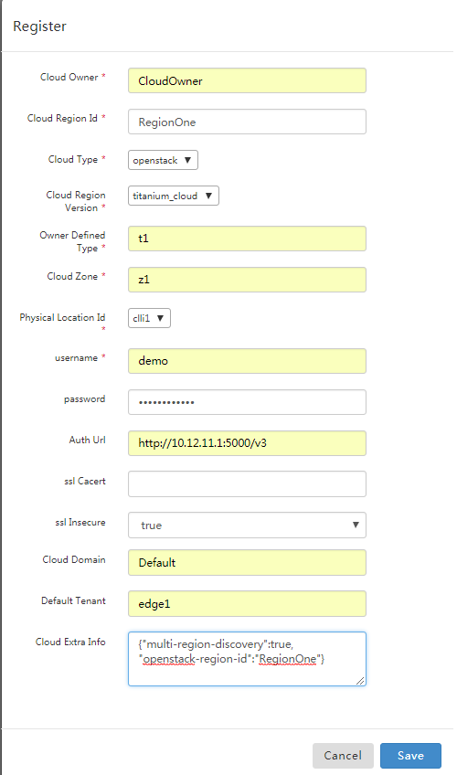

.. This work is licensed under a Creative Commons Attribution 4.0
.. International License.  http://creativecommons.org/licenses/by/4.0
.. Copyright (c) 2017-2018 Wind River Systems, Inc.

Tutorial: Onboard instance of Wind River Titanium Cloud
```````````````````````````````````````````````````````

Prerequisites
-------------

Collect ONAP Access Info
^^^^^^^^^^^^^^^^^^^^^^^^

With Heat based ONAP:
.....................

.. code-block:: console

    export ONAP_AAI_IP=<floating IP of VM with name "onap-aai-inst1">
    export ONAP_AAI_PORT=8443
    export ONAP_MSB_IP=<floating IP of VM with name "onap-multi-service">
    export ONAP_MSB_PORT=80

With OOM based ONAP:
....................

.. code-block:: console

    export ONAP_AAI_IP=<floating IP of VM with name "k8s_1">
    export ONAP_AAI_PORT=30233
    export ONAP_MSB_IP=<floating IP of VM with name "k8s_1">
    export ONAP_MSB_PORT=30280

Determine the ID of the cloud region:
^^^^^^^^^^^^^^^^^^^^^^^^^^^^^^^^^^^^^

    cloud region is ONAP's representation of the on-boarded VIM/Cloud instance (Titanium Cloud instance in this case).
    The ID of a cloud region is specified by ONAP user while on-boarding the VIM/Cloud instance, this ID will be
    internal to ONAP only, comprised by the composite keys of "cloud-owner" and "cloud-region-id".

.. code-block:: console

    export CLOUD_OWNER="CloudOwner"
    export CLOUD_REGION_ID="RegionOne"


Notes:
......

    1, It is suggested to populate "cloud-owner" to be "CloudOwner".
    The restriction is that underscore "_" can not be used.

    2, There is restriction from ONAP Amsterdam Release that the
    "cloud-region-id" must be the same as OpenStack Region ID in case that
    the cloud region represent an OpenStack Instance.
    From Casablanca Release, the restriction of "cloud-region-id" has been
    removed by MultiCloud plugin for Wind River Titanium Cloud. It is not
    mandatory to be populate the "cloud-region-id" with OpenStack Region ID.


The geographic location of the cloud region
^^^^^^^^^^^^^^^^^^^^^^^^^^^^^^^^^^^^^^^^^^^

make sure there is complex object to represent the geographic location of the cloud region
in case you need create a complex object "clli1":

.. code-block:: console

    curl -X PUT \
    https://$ONAP_AAI_IP:$ONAP_AAI_PORT/aai/v13/cloud-infrastructure/complexes/complex/clli1 \
    -H 'Accept: application/json' \
    -H 'Authorization: Basic QUFJOkFBSQ==' \
    -H 'Cache-Control: no-cache' \
    -H 'Content-Type: application/json' \
    -H 'Postman-Token: 2b272126-aa65-41e6-aa5d-46bc70b9eb4f' \
    -H 'Real-Time: true' \
    -H 'X-FromAppId: jimmy-postman' \
    -H 'X-TransactionId: 9999' \
    -d '{
        "physical-location-id": "clli1",
        "data-center-code": "example-data-center-code-val-5556",
        "complex-name": "clli1",
        "identity-url": "example-identity-url-val-56898",
        "physical-location-type": "example-physical-location-type-val-7608",
        "street1": "example-street1-val-34205",
        "street2": "example-street2-val-99210",
        "city": "Beijing",
        "state": "example-state-val-59487",
        "postal-code": "100000",
        "country": "example-country-val-94173",
        "region": "example-region-val-13893",
        "latitude": "39.9042",
        "longitude": "106.4074",
        "elevation": "example-elevation-val-30253",
        "lata": "example-lata-val-46073"
        }'


On-board Wind River Titanium Cloud Instance
-------------------------------------------

You can on-board the instance of Wind River Titanium Cloud with either way as below


With curl commands
^^^^^^^^^^^^^^^^^^

Step 1: Create a cloud region to represent the instance
.......................................................

.. code-block:: console

    ### on-board a single OpenStack region
    ### you can specify the Openstack Region ID by extra inputs: {"openstack-region-id":"RegionOne"}


    curl -X PUT \
    https://$ONAP_AAI_IP:$ONAP_AAI_PORT/aai/v13/cloud-infrastructure/cloud-regions/cloud-region/${CLOUD_OWNER}/${CLOUD_REGION_ID} \
    -H 'Accept: application/json' \
    -H 'Authorization: Basic QUFJOkFBSQ==' \
    -H 'Cache-Control: no-cache' \
    -H 'Content-Type: application/json' \
    -H 'Postman-Token: 8b9b95ae-91d6-4436-90fa-69cb4d2db99c' \
    -H 'Real-Time: true' \
    -H 'X-FromAppId: jimmy-postman' \
    -H 'X-TransactionId: 9999' \
    -d '{
        "cloud-owner": "<${CLOUD_OWNER}>",
        "cloud-region-id": "<${CLOUD_REGION_ID}>",
        "cloud-type": "openstack",
        "owner-defined-type": "t1",
        "cloud-region-version": "titanium_cloud",
        "complex-name": "clli1",
        "cloud-zone": "CloudZone",
        "sriov-automation": false,
        "identity-url": "WillBeUpdatedByMultiCloud",
        "cloud-extra-info":"{\"openstack-region-id\":\"RegionOne\"}"
        "esr-system-info-list": {
            "esr-system-info": [
                {
                "esr-system-info-id": "<random UUID, e.g. 5c85ce1f-aa78-4ebf-8d6f-4b62773e9bde>",
                "service-url": "http://<your openstack keystone endpoint, e.g. http://10.12.25.2:5000/v3>",
                "user-name": "<your openstack user>",
                "password": "<your openstack password>",
                "system-type": "VIM",
                "ssl-insecure": true,
                "cloud-domain": "Default",
                "default-tenant": "<your openstack project name>",
                "system-status": "active"
                }
            ]
          }
        }'


.. code-block:: console

    ### on-board multiple OpenStack regions with a single request by indicating {"multi-region-discovery":true}
    ### you can specify the Openstack Region ID by extra inputs: {"openstack-region-id":"RegionOne"}

    curl -X PUT \
    https://$ONAP_AAI_IP:$ONAP_AAI_PORT/aai/v13/cloud-infrastructure/cloud-regions/cloud-region/${CLOUD_OWNER}/${CLOUD_REGION_ID} \
    -H 'Accept: application/json' \
    -H 'Authorization: Basic QUFJOkFBSQ==' \
    -H 'Cache-Control: no-cache' \
    -H 'Content-Type: application/json' \
    -H 'Postman-Token: 8b9b95ae-91d6-4436-90fa-69cb4d2db99c' \
    -H 'Real-Time: true' \
    -H 'X-FromAppId: jimmy-postman' \
    -H 'X-TransactionId: 9999' \
    -d '{
        "cloud-owner": "<${CLOUD_OWNER}>",
        "cloud-region-id": "<${CLOUD_REGION_ID}>",
        "cloud-type": "openstack",
        "owner-defined-type": "t1",
        "cloud-region-version": "titanium_cloud",
        "complex-name": "clli1",
        "cloud-zone": "CloudZone",
        "sriov-automation": false,
        "identity-url": "WillBeUpdatedByMultiCloud",
        "cloud-extra-info":"{\"multi-region-discovery\":true, \"openstack-region-id\":\"RegionOne\"}"
        "esr-system-info-list": {
            "esr-system-info": [
                {
                "esr-system-info-id": "<random UUID, e.g. 5c85ce1f-aa78-4ebf-8d6f-4b62773e9bde>",
                "service-url": "http://<your openstack keystone endpoint, e.g. http://10.12.25.2:5000/v3>",
                "user-name": "<your openstack user>",
                "password": "<your openstack password>",
                "system-type": "VIM",
                "ssl-insecure": true,
                "cloud-domain": "Default",
                "default-tenant": "<your openstack project name>",
                "system-status": "active"
                }
            ]
          }
        }'


Step 2: associate the cloud region with the location object
...........................................................


This association between the cloud region and location is required for OOF homing/placement of VNF

.. code-block:: console

    curl -X PUT \
    https://$ONAP_AAI_IP:$ONAP_AAI_PORT/aai/v13/cloud-infrastructure/cloud-regions/cloud-region/${CLOUD_OWNER}/${CLOUD_REGION_ID}/relationship-list/relationship \
    -H 'Authorization: Basic QUFJOkFBSQ==' \
    -H 'Cache-Control: no-cache' \
    -H 'Content-Type: application/json' \
    -H 'Postman-Token: 7407d60c-8ce7-45de-ada3-4a7a9e88ebd4' \
    -H 'Real-Time: true' \
    -H 'X-FromAppId: jimmy-postman' \
    -H 'X-TransactionId: 9999' \
    -d '{
        "related-to": "complex",
        "related-link": "/aai/v13/cloud-infrastructure/complexes/complex/clli1",
        "relationship-data": [
            {
            "relationship-key": "complex.physical-location-id",
            "relationship-value": "clli1"
            }
            ]
        }'


Step 3: Trigger the MultiCloud Plugin registration process
..........................................................


Make sure trigger MultiCloud plugin to discover and register Infrastructure
resources, including HPA

.. code-block:: console

    curl -X POST \
    http://$ONAP_MSB_IP:$ONAP_MSB_PORT/api/multicloud/v0/${CLOUD_OWNER}_${CLOUD_REGION_ID}/registry \
    -H 'Accept: application/json' \
    -H 'Cache-Control: no-cache' \
    -H 'Content-Type: application/json' \
    -H 'Postman-Token: 8577e1cc-1038-471d-8b3b-d36fe44ae023'


With ESR GUI Portal
^^^^^^^^^^^^^^^^^^^
ESR will conduct all steps mentioned above with a single click.

The url of the ESR GUI Portal is:

.. [ESR VIM Portal] http://$ONAP_MSB_IP:$ONAP_MSB_PORT/iui/aai-esr-gui/extsys/vim/vimView.html




Verification
------------

You may want to verify if the cloud region was registered properly (with HPA information populated)
to represent the instance of Wind River Titanium Cloud, you can do it with the curl command as below

.. code-block:: console

    curl -X GET \
    https://$ONAP_AAI_IP:$ONAP_AAI_PORT/aai/v13/cloud-infrastructure/cloud-regions/cloud-region/${CLOUD_OWNER}/${CLOUD_REGION_ID}?depth=all \
    -H 'Accept: application/json' \
    -H 'Authorization: Basic QUFJOkFBSQ==' \
    -H 'Cache-Control: no-cache' \
    -H 'Content-Type: application/json' \
    -H 'Postman-Token: 2899359f-871b-4e61-a307-ecf8b3144e3f' \
    -H 'Real-Time: true' \
    -H 'X-FromAppId: jimmy-postman' \
    -H 'X-TransactionId: 9999'


Note:
^^^^^
The response of querying a cloud region above should return with a comprehensive cloud region object, you should find out the "hpa-capabilities" under certain flavor object with name prefixed by "onap."

